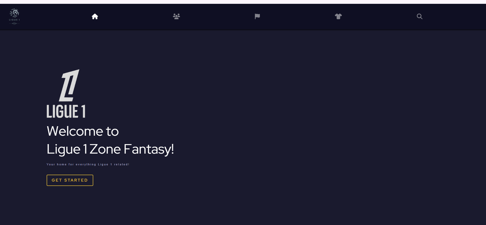
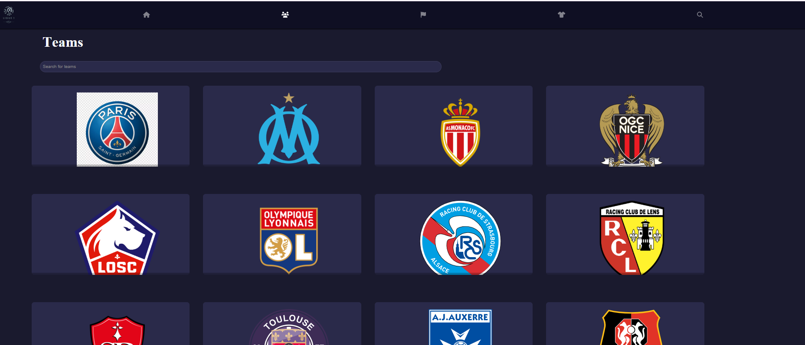
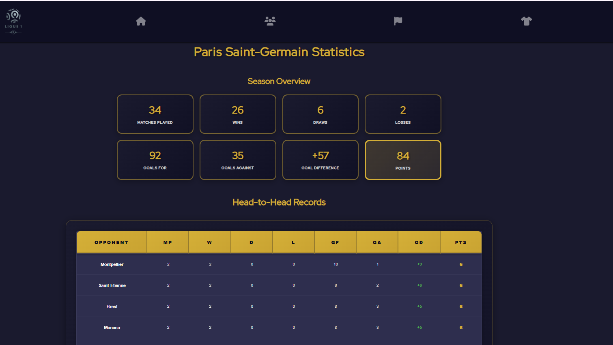
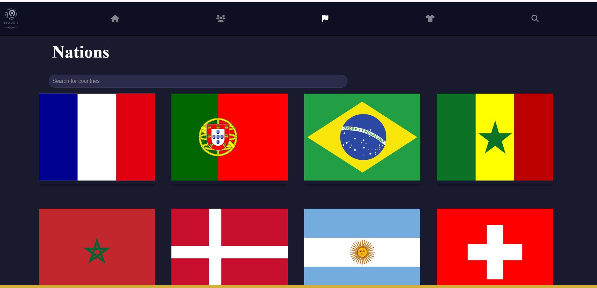
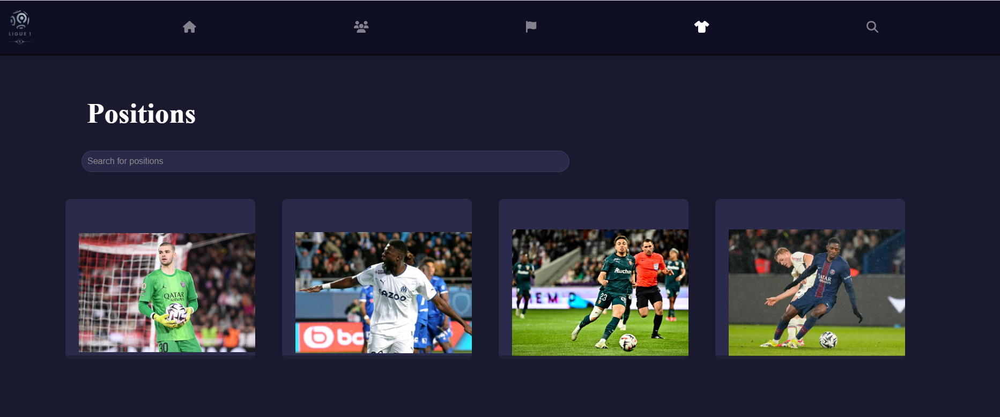

# Ligue 1 Zone Fantasy

Ligue 1 Zone Fantasy is a comprehensive web application designed to scrape match statistics for Ligue 1 players, manipulate and present the data dynamically, and predict match outcomes using machine learning. The project is divided into four main components: Backend, Frontend, Data Scraping, and Machine Learning.

## Features

- **Data Scraping**: Engineered a comprehensive data scraping of match statistics for 100+ Ligue 1 players using Python, BeautifulSoup, and pandas from FBref.
- **Backend**: Dynamic manipulation and presentation of the scraped data through a Spring Boot application.
- **Database**: Real-time data manipulation within a Postgres database using SQL queries.
- **Frontend**: Seamless integration with a modern, dark-themed ReactJS interface featuring all 18 Ligue 1 teams.
- **Machine Learning**: Created a model to predict match outcomes by integrating data scraping with pandas and machine learning with scikit-learn.
- **Dark Theme**: Professional dark theme inspired by the official Ligue 1 website with gold accents.
- **Nation Filtering**: Browse players by 40+ different nationalities represented in Ligue 1.
- **Team Pages**: Explore all 18 Ligue 1 teams with official logos and player rosters.
- **Team Statistics**: Detailed match statistics and head-to-head records for each team.
- **Match Predictor**: ML-based prediction system with 64% accuracy for Ligue 1 matches.

## Screenshots

### Home Page


### Teams Overview


### Team Statistics - Paris Saint-Germain


### Nations Filter


### Positions and Player Search


## Technology Stack

### Frontend
- ReactJS
- SCSS/Sass
- React Router
- Axios
- Animated Letters
- React Country Flag

### Backend
- Java Spring Boot
- PostgreSQL
- RESTful APIs
- Maven

### Machine Learning
- Python
- Scikit-learn
- Pandas
- NumPy
- Random Forest Classifier

### Data Sources
- FBref.com for player statistics
- football_matches_2024_2025.csv for match data

## Installation

### Prerequisites
- Node.js (v14 or higher)
- Java 11 or higher
- Maven
- Python 3.9+
- PostgreSQL

### Frontend Setup
```bash
cd Frontend
npm install
npm start
```

### Backend Setup
```bash
cd Backend
./mvnw spring-boot:run
```

### Match Predictor Setup
```bash
cd MLPredictionsL1
pip install -r requirements.txt
python L1Predictions.py
```

## Usage

1. **View Teams**: Navigate to the Teams tab to see all 18 Ligue 1 teams
2. **Team Statistics**: Click on any team to view detailed statistics
3. **Search Players**: Use the Search tab to find specific players
4. **Filter by Nation**: Browse players by nationality in the Nations tab
5. **Filter by Position**: Find players by their playing position
6. **Predict Matches**: Run the ML predictor to forecast match outcomes

## Project Structure

```
ligue1predict/
├── Frontend/          # ReactJS frontend application
├── Backend/           # Spring Boot backend API
├── DataScraping/      # Python scripts for data scraping
├── MLPredictionsL1/   # ML prediction models
├── screenshots/       # Application screenshots
└── README.md         # This file
```
